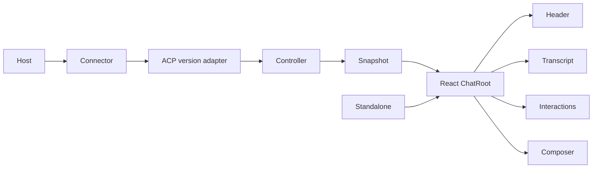

# Architecture

Core owns ACP connection and normalized chat state behind the `ChatController`
interface. Protocol adapters translate wire versions into that interface.
Tool normalization recognizes a subagent only when a `think` tool carries the
OpenCode task input shape. The normalized `ChatToolCall.subagent` value owns the
bounded agent name, description, background intent, and any child-session ID
published through the task input or settled output. Presentation never infers
child-session identity from rendered text or polls an agent-private API.
`ChatRoot` owns one snapshot subscription and shares the controller, snapshot,
presentation settings, and per-instance IDs through a private React context.
The flat React macros consume that context; they do not create controllers or
subscribe independently. `Chat` is only the default macro composition.
In browsers, the root coalesces bursty snapshot notifications to one render per
animation frame while always reading the controller's latest immutable state.

Core is framework-neutral. Shared labels, color scheme, and surface vocabulary
are React-free presentation contracts. React owns component props, visual
tokens, and tool rendering. Standalone mounts the same React composition into a
newly attached open Shadow DOM and is not a second renderer. It accepts either
a caller-owned controller or immutable controller options, never both. A
borrowed controller outlives the mount; an options-owned controller is destroyed
with its root. Standalone refuses an existing or concurrently owned shadow
root, exposes bounded draft and composer-focus operations instead of requiring
Shadow DOM traversal, and can nonce its package-owned style for a strict host
CSP.
Controller ownership is terminal: late connection or session work cannot
commit after destruction. One controller owns one connection and at most 16
loaded session records. Loading reservations and new-session creation share
one capacity and lifecycle boundary; connection replacement/new-session work
and target-session mutations are mutually exclusive, while mutations for
different target sessions may overlap. Prompts cannot begin while their target
session is being mutated. Each loaded record has an opaque incarnation identity
that survives restoration of the same logical session but changes whenever a
fresh local record is created, even if an Agent reuses the same session ID.
Each record owns its timeline, turn, configuration, usage, protocol state, and
interactions. A session permits one turn at a time
while different sessions may run concurrently. Selecting a loaded session
changes only the active snapshot projection; it never closes or cancels another
session. Session operations are single-flight per target, and connection
replacement is single-flight for the whole controller. Concurrent session-list
reads for the same cursor share one request; a different cursor remains busy so
pagination cannot commit out of order. Unknown-session updates are diagnosed
without allocating state. Permission requests remain with their owning session
and surface a background badge rather than stealing the active selection. URL
elicitation completion is correlated by the agent-provided elicitation identity
and resolves through the same interaction seam as a local response.
Child-session navigation is an explicit controller operation. A successful
child open appends the previous active session to `sessionTrail`; a successful
ancestor open truncates that trail. Ordinary history opens, new sessions, and
session close clear it. Failed, superseded, busy, or destroyed operations leave
the active session and trail unchanged, while reconnecting the same active
session preserves the trail. The trail records only navigation observed by
this controller; ACP does not provide authoritative session lineage.
Reconnect is rejected while any loaded session has an active turn or
interaction. It restores the selected session first and then other loaded
sessions serially through resume when available or full load for load-only ACP
v1 agents. Failure to restore the selected session fails the connection
replacement; failure to restore a background session marks only that record as
failed. An agent exposing neither capability receives one genuinely fresh
session and the prior loaded records are discarded rather than relabeled.
The package root, `./core`, and `./standalone` entries are React-free;
`./react` is the only entry whose interface requires the optional React peers.
Borrowed-controller rendering supports SSR from the controller's current
snapshot. Options-owned rendering emits the same inert connecting composition
on the server and during the first client render; transport ownership begins
only in an effect.

The host owns the outer inline or sidebar shell. The renderer responds to the
width of its own container and never mutates `body`, installs a viewport-level
layout, or portals an outer sidebar. Manual composition and theming contracts
are specified in [Composition](composition.md).

Controller construction may connect without creating a session, create a new
session, or open a named session. The default remains new-session creation.
An Agent JSON-RPC rejection of session creation/opening crosses the adapter as
a structured `SESSION_REJECTED` error with the owning `session/new` or
`session/open` phase, so hosts can distinguish a stale saved session from
transport initialization. Local connection and validation failures retain
their existing structured codes instead of being relabeled as Agent rejection.
The context-provider adapter owns the observable selection for the next turn,
including optional add and remove operations, while the controller owns its
bounded immutable projection. Sending freezes that selection before resolution.
The provider receives the frozen IDs, labels, initialized prompt capabilities,
and user input, and must return the same IDs in the same order; it can therefore
choose embedded resources or a text fallback without letting composer state,
wire content, and transparency records diverge. Context is prepended to the ACP
prompt but committed to the owning session's timeline only after prompt dispatch
starts. Each accepted item becomes a package-owned context activity following
that turn's user message, preserving the exact bounded blocks sent for the
lifetime of the loaded controller session. Context activities are not
reconstructed from unmarked Agent history and are not a second durable session
store. A host may forbid agent authentication; an agent that requires it then
fails explicitly without presenting or sending authentication operations.

## Trust

The host owns endpoint authentication and client handlers. Protocol adapters
receive agent-controlled messages; the renderer controls what becomes active
browser content. Markdown uses restrictive renderers that make raw HTML,
images, task controls, and unsafe links inert; browser and server rendering add
DOMPurify through an isomorphic adapter as defense in depth. Durable and
external inputs are validated at their owning seam, and custom tool renderers
receive normalized `ChatToolCall` values rather than raw protocol messages.

The default protocol budgets are 2 MiB per decoded inbound or outbound wire
message, 16 loaded
sessions, 1,000 retained activities per session, 256 items per normalized
collection, 256 content blocks per message, 1 MiB per text or terminal value, 8
MiB per base64 media value, and 16 simultaneous interactions across the
controller. Loading reservations count toward the session limit; capacity
failure occurs before a remote session operation, and records are never
implicitly evicted or remotely closed. Structured payloads are copied to at
most 4,096 nodes and 16 levels. Each terminal accepts at most 4,096 output chunks and 4 MiB
of decoded output during its retained lifetime while exposing only its newest
1 MiB. Numeric usage values must be finite and non-negative. Text truncation
preserves valid UTF-16 boundaries; a streamed text value retains its newest
content so a concluding fragment is not discarded. Navigable content accepts
only absolute `http`, `https`, or `file` URIs; inert resource identifiers may
use other absolute schemes such as a host-owned `peval:` URI and are never
navigated or fetched by the built-in renderer. Decoded wire messages are
measured as serialized JSON in UTF-8 bytes rather than JavaScript code units.
Values beyond these budgets are
rejected, truncated, or evicted at the protocol normalization seam according
to whether partial data remains meaningful.

Session state notifications affect presentation only while their owning turn
is active; late state notifications are ignored and diagnosed. An interaction
beyond the simultaneous limit is cancelled and emits an `INTERACTION_LIMIT`
diagnostic so hosts can observe the denial. Once a v2 cancellation notification
has been accepted locally, the pending foreground turn settles as cancelled
without depending on a later agent `idle` notification. Because v2 state
updates carry no turn identity, that session remains in `cancelling` and rejects
another prompt until the Agent's `idle` acknowledgement arrives; reconnect is
the recovery path for a non-conforming Agent that never acknowledges
cancellation. A late cancellation `idle` can therefore never settle a
replacement turn.

Every module emitted for the standalone browser entry pre-populates Zod's
documented cross-copy global configuration with `jitless: true` before bundled
SDK code runs, so the compatibility probe is not evaluated under a strict CSP.
This also selects Zod's non-JIT validation path for other Zod copies on the same
page. The entry's only inline style element is package-owned and accepts the
host-provided CSP nonce. Presentation code may use bounded CSSOM property
updates, but does not serialize untrusted style attributes. The standalone
mount's package-owned wrapper fills a mount target that supplies a definite
height, carrying percentage height through the Shadow DOM so the transcript
remains the scroll owner while the composer stays inside the host. The adapter
never assigns the host or viewport size.

Caller-supplied Streamable HTTP authentication headers follow only bounded,
same-origin redirects when the injected fetch implementation exposes redirect
status and `Location`. Browser Fetch deliberately hides manual redirects as
opaque responses, so the connector rejects those redirects with a structured
configuration error instead of forwarding an uninspectable response or risking
header disclosure. Built-in connector lifetimes are bound to their owning abort
signal. The development-only OpenCode bridge requires a random
short-lived per-process token carried outside URLs and logs as a WebSocket
subprotocol before upgrade; that bridge-only credential is removed from the
spawned agent environment. It requires both a loopback TCP peer and a loopback
or explicitly allowed browser Origin, rejects non-loopback binds, and bounds
connections, frames, subprocess pipes, and WebSocket output buffers.

## Source and generated output

TypeScript under `src/` is authoritative. `dist/` is generated from it and is
never edited directly. The readable modular output and browser-ready
standalone output are tracked and shipped with source maps for consumer
diagnostics; `build:check` guards them against source drift. Exported types own
field-level contracts, and tests own behavioral evidence. Example applications
are executable fixtures, not a second source of package behavior. Screenshot
baselines are reviewed contract artifacts and are changed intentionally.
