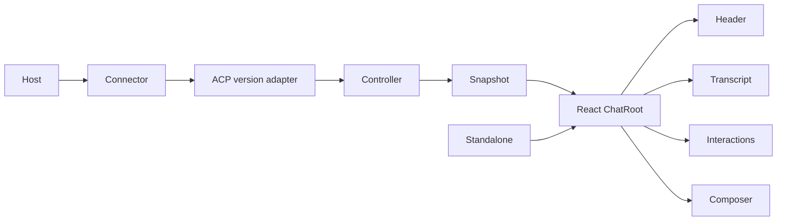

# Architecture

Core owns ACP connection and normalized chat state behind the `ChatController`
interface. Protocol adapters translate wire versions into that interface.
Tool normalization recognizes a subagent only when a `think` tool carries the
OpenCode task input shape. The normalized `ChatToolCall.subagent` value owns the
bounded agent name, description, background intent, and any child-session ID
published through the task input or settled output. Presentation never infers
child-session identity from rendered text or polls an agent-private API.
`ChatRoot` owns one snapshot subscription and shares the controller, snapshot,
presentation settings, and per-instance IDs through a private React context.
The flat React macros consume that context; they do not create controllers or
subscribe independently. `Chat` is only the default macro composition.
In browsers, the root coalesces bursty snapshot notifications to one render per
animation frame while always reading the controller's latest immutable state.

Core is framework-neutral. Shared labels, color scheme, and surface vocabulary
are React-free presentation contracts. React owns component props, visual
tokens, and tool rendering. Standalone owns a controller and
mounts the same React composition into a newly attached open Shadow DOM; it
refuses an existing or concurrently owned shadow root and is not a second
renderer. A controller passed to React remains caller-owned. A controller
created from immutable `options` is destroyed with its owning root.
Controller ownership is terminal: late connection or session work cannot
commit after destruction. Foreground turns, reconnects, session mutations, and
session-list requests are each single-flight; reconnect cannot replace a
session while its turn or interaction is active. Permission requests are
accepted only for the active turn and session. URL elicitation completion is correlated by the agent-provided
elicitation identity and resolves through the same interaction seam as a local
response.
Child-session navigation is an explicit controller operation. A successful
child open appends the previous active session to `sessionTrail`; a successful
ancestor open truncates that trail. Ordinary history opens, new sessions, and
session close clear it. Failed, superseded, busy, or destroyed operations leave
the active session and trail unchanged, while reconnecting the same active
session preserves the trail. The trail records only navigation observed by
this controller; ACP does not provide authoritative session lineage.
Reconnect preserves the active session through resume when available, or a
full load for load-only ACP v1 agents; it creates a new session only when the
agent exposes neither capability. That fallback is a genuinely fresh session
and starts with an empty timeline rather than relabeling the previous
transcript.
The package root, `./core`, and `./standalone` entries are React-free;
`./react` is the only entry whose interface requires the optional React peers.
Borrowed-controller rendering supports SSR from the controller's current
snapshot. Options-owned rendering emits the same inert connecting composition
on the server and during the first client render; transport ownership begins
only in an effect.

The host owns the outer inline or sidebar shell. The renderer responds to the
width of its own container and never mutates `body`, installs a viewport-level
layout, or portals an outer sidebar. Manual composition and theming contracts
are specified in [Composition](composition.md).

## Trust

The host owns endpoint authentication and client handlers. Protocol adapters
receive agent-controlled messages; the renderer controls what becomes active
browser content. Markdown uses restrictive renderers that make raw HTML,
images, task controls, and unsafe links inert; browser and server rendering add
DOMPurify through an isomorphic adapter as defense in depth. Durable and
external inputs are validated at their owning seam, and custom tool renderers
receive normalized `ChatToolCall` values rather than raw protocol messages.

The default protocol budgets are 2 MiB per decoded wire message, 1,000 retained
activities per session, 256 items per normalized collection, 256 content blocks
per message, 1 MiB per text or terminal value, 8 MiB per base64 media value, and
16 simultaneous interactions. Structured payloads are copied to at most 4,096
nodes and 16 levels. Each terminal accepts at most 4,096 output chunks and 4 MiB
of decoded output during its retained lifetime while exposing only its newest
1 MiB. Numeric usage values must be finite and non-negative. Text truncation
preserves valid UTF-16 boundaries; a streamed text value retains its newest
content so a concluding fragment is not discarded. URI-bearing content accepts
only absolute `http`, `https`, or `file` URIs. Decoded wire-message text is
measured in UTF-8 bytes rather than JavaScript code units. Values beyond these budgets are
rejected, truncated, or evicted at the protocol normalization seam according
to whether partial data remains meaningful.

Session state notifications affect presentation only while their owning turn
is active; late state notifications are ignored and diagnosed. An interaction
beyond the simultaneous limit is cancelled and emits an `INTERACTION_LIMIT`
diagnostic so hosts can observe the denial. Once a v2 cancellation notification
has been accepted locally, the pending foreground turn settles as cancelled
without depending on a later agent `idle` notification.

Caller-supplied Streamable HTTP authentication headers follow only bounded,
same-origin redirects when the injected fetch implementation exposes redirect
status and `Location`. Browser Fetch deliberately hides manual redirects as
opaque responses, so the connector rejects those redirects with a structured
configuration error instead of forwarding an uninspectable response or risking
header disclosure. Built-in connector lifetimes are bound to their owning abort
signal. The development-only OpenCode bridge requires a random
short-lived per-process token carried outside URLs and logs as a WebSocket
subprotocol before upgrade; that bridge-only credential is removed from the
spawned agent environment. It requires both a loopback TCP peer and a loopback
or explicitly allowed browser Origin, rejects non-loopback binds, and bounds
connections, frames, subprocess pipes, and WebSocket output buffers.

## Source and generated output

TypeScript under `src/` is authoritative. `dist/` is generated from it and is
never edited directly. The readable modular output and browser-ready
standalone output are tracked and shipped with source maps for consumer
diagnostics; `build:check` guards them against source drift. Exported types own
field-level contracts, and tests own behavioral evidence. Example applications
are executable fixtures, not a second source of package behavior. Screenshot
baselines are reviewed contract artifacts and are changed intentionally.
